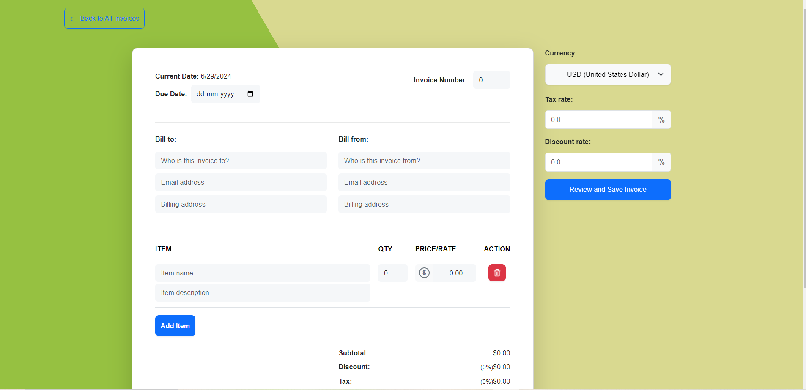

# Invoice Generator - React App
 





An Invoice creator project built with React and Redux. Add itemized items, configure quantity, prices, tax rates and discounts. Download Invoice as PDFs to your device. Uses [jspdf-react](https://www.npmjs.com/package/jspdf-react) to capture the data from the modal and covert it from canvas -> pdf.

## Table of Contents

- [Features](#features)
- [Technologies Used](#technologies-used)
- [Installation](#installation)
- [Usage](#usage)
- [Contributing](#contributing)
- [License](#license)

### Live Demo
https://invo-gen.netlify.app/
### Installation

```
https://github.com/omgupta7352/Invo-Gen.git
npm install

npm start / npm run build
```

### How to use the app
- Click on the **"Create New Invoice"** button to *create a new invoice*.
    - Fill in the details of the invoice and click on the "Add Item" button to add items to the invoice.
    - The invoice number is set manually and is not auto-generated.
    - It is **mandatory** to fill in the **invoice number**, **due date** and other details <font color='red'><u>*except*</u></font> Notes, Tax Rates and Discount Rates.
    - Click on **'Review and Save Invoice'** button to save the invoice. Then it will redirect you to the invoice list page.

- To **View** an Invoice, click on the *"View" button* in the invoice list page.
- To **Download** a PDF of the invoice, *click on 'view' button* of a particular invoice > click on the "*Download Copy*" button.
- Click on the **"Edit"** button to *edit an invoice*.
- Click on the **"Delete"** button to *delete an invoice*.

### To-Do
- [x] Finish parsing data into Preview Modal
- [x] Currency Picker
- [x] Calculate Tax and Discounts
- [x] Integration od Redux and Redux Store
- [x] Add Redux to Preview Modal
- [x] Add Redux to Invoice List
- [x] Make list of invoices as first screen and move the create to a new create invoice button
- [x] In the invoice list, add buttons or options for view, edit, and delete operations.
- [x] Ensure proper state management throughout the application by connecting components to the Redux store.
- [x] Make sure the application handles errors gracefully
- [x] Write clean, well-documented, and modular code.
